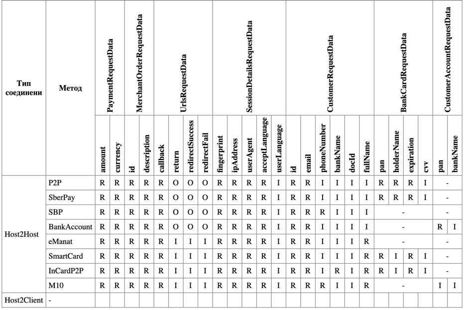

# Billing SDK

## Общее описание

Пакет предназначен для интеграции внешней системы на PHP 7.4+ и B2B backoffice сервиса Billing
для создания транзакций в платежных системах, зарегистрированных в B2B backoffice.Billing.

Пакет позволяет выполнять следующие действия:
- Получить список доступных платежных методов
- Создавать транзакцию для пополнения денежных средств на счете.
- Создавать транзакцию для вывода денежных средств со счета.
- Получить информацию о транзакции.

Действия для пополнения и вывода средтсв только инициируют начало действий со
счетом, но не выполняют эти операции полностью от начала до конца, т.е. после
создания данных для проведения операции необходимо будет выполнить дополнительные
действия, описанные в документации по работе с сервисом Billing системы
B2B Backoffice.

## Требования

Приложение, на которое устанавливается пакет должна иметь:

- PHP 7.4 или выше
- ext-openssl - установленное расширение для php
- ext-json - установленное расширение для php

## Установка

1. В каталоге Вашего проекта, где расположен файл composer.json, выполните команду:
```
composer require idynsys/billing-sdk
```
2. Настройка Вашего приложения для выполнения запроса к B2B Backoffice.<br>  
   Для выполнения запроса необходимо в запросах передавать информацию об идентификаторе
   приложения с использованием секретного ключа для подписи параметров запрос. Это
   можно сделать двумя способами.<br>  
   2.1. Через переменные окружения:<br>  
   В переменных окружения приложения, где устанавливается этот пакет, необходимо создать
   переменные окружения:
    ```dotenv
    BILLING_SDK_CLIENT_ID=<clientId>
    BILLING_SDK_APPLICATION_SECRET_KEY=<secret>
    ```
   <br>  

   2.2. Через создание объекта от класса Billing:
    ```php
    $billing = new \Idynsys\BillingSdk\Billing('<clientId>', '<secret>');
    ```

   где "clientId" и "secret" будут переданы Вашей компании после регистрации внешнего
   приложения в B2B Backoffice для возможности выполнения запросов через B2B.

<br>
3. !!! Для версии на Production необходимо установить переменную окружения:

```dotenv
BILLING_SDK_MODE=PRODUCTION
```
Если эта переменная не установлена или имеет другое значение, то все запросы
будут перенаправляться на тестовый сервер B2B Backoffice.

## Использование

### Создать экземпляр класса Billing:

```php
<?php

use Idynsys\BillingSdk\Billing;
...

// Если "clientId" и "secret" установлены через переменные окружения (см. п.2.1.)
$billing = new Billing();
...

// или через прямое указание через параметры (см. п.2.2.)
$billing = new Billing('clientId', 'secret');
...
```
### Описание методов класса Billing:

#### Получить список доступных платежных методов

В классе DTO есть параметр "trafficType". Этот параметр необязательный и может принимать следующие значения:
- ftd - первичный трафик (для непроверенных пользователей делающих оплату первый раз)
- trusted - вторичный трафик (для доверенных пользователей)

```php
<?php

use Idynsys\BillingSdk\Collections\PaymentMethodsCollection;
use Idynsys\BillingSdk\Data\Requests\PaymentMethods\v2\PaymentMethodListRequestData;

$requestParameters = new PaymentMethodListRequestData(
    $amount,        // сумма, по которой вбираются доступные платежные методы
    $currency,      // валюта, по которой выбираются доступные платежные методы
    $paymentType,   // тип платежа, доступные значения - deposit, withdrawal
    $trafficType    // Тип трафика для выполнения транзакции в платёжной системе
);

/** @var PaymentMethodsCollection $result */
$result = $billing->getPaymentMethods($requestParameters);
```
Ответ (response) для данного запроса будет объект класса
_\Idynsys\BillingSdk\Collections\PaymentMethodsCollection_. Этот класс реализует интерфейс _Iterator_.
Элементами этой коллекции будут объекты класса _\Idynsys\BillingSdk\Data\Entities\PaymentMethodData_.
```php
// получить список объектов коллекции

$result->all();
```

#### Получить список валют для платежных методов

В классе DTO есть параметр "trafficType". Этот параметр необязательный и может принимать следующие значения:
- ftd - первичный трафик (для непроверенных пользователей делающих оплату первый раз)
- trusted - вторичный трафик (для доверенных пользователей)

```php
<?php

use Idynsys\BillingSdk\Data\Requests\Currencies\PaymentMethodCurrenciesRequestData;
use Idynsys\BillingSdk\Collections\PaymentMethodCurrenciesCollection;

/* Значение метода - одна из 3х констант: 
     Idynsys\BillingSdk\Enums\PaymentMethod::P2P_NAME
     Idynsys\BillingSdk\Enums\PaymentMethod::BANKCARD_NAME
     Idynsys\BillingSdk\Enums\PaymentMethod::M_COMMERCE_NAME
*/
$paymentMethodName = \Idynsys\BillingSdk\Enums\PaymentMethod::P2P_NAME;
$requestParams = new PaymentMethodCurrenciesRequestData(
    $paymentMethodName, // наименование платежного метода
    $amount,            // сумма, для которой ищется платежный метод
    $paymentType,       // тип платежа, доступные значения - deposit, withdrawal
    $trafficType        // Тип трафика для выполнения транзакции в платёжной системе
);

/** @var PaymentMethodCurrenciesCollection $result */
$result = $billing->getPaymentMethodCurrencies($requestParams);
```
Ответ (response) для данного запроса будет объект класса
_\Idynsys\BillingSdk\Collections\PaymentMethodCurrenciesCollection_.
Этот класс реализует интерфейс _Iterator_. Элементами этой коллекции будут объекты
класса _\Idynsys\BillingSdk\Data\Entities\CurrencyData_.
```php
// получить список объектов коллекции

$result->all();
```

#### Создать транзакцию для пополнения счета

##### Универсальный метод создания депозитов

Некоторые депозиты создаются через универсальный метод создания депозитов. Для создания депозита при помощи универсального метода необходимо:
1. Создать все DTO подобъекты, необходимые для описания депозита:
   - PaymentRequestData - обязательно для любого депозита, информация о сумме и валюте депозита
   - MerchantOrderRequestData - обязательно для любого депозита, информация об исходном документе, на основании которого формируется депозит
   - UrlsRequestData - обязательно для любого депозита, все необходимые ссылки для отправки ответов при создании депозита
   - SessionDetailsRequestData - обязательно для любого депозита, информация о сессии пользователя, браузере и др.
   - CustomerRequestData - обязательно для любого депозита, информация о пользователе и его контакты, который выполняет депозит
   - BankCardRequestData - необязательно, используется только для депозитов, которые выполняются через данные банковской карты.
   Детальное описание свойств DTO-классов находится в этом же разделе.
2. Создать объект с данными универсального DTO депозита UniversalDepositRequestData, использую объекты классов из п.1.
3. Отправить запрос, для создания и выполнения депозита.
4. Обработать ответ.

Пример создания депозита при помощи DTO для универсального метода:
```php

use Idynsys\BillingSdk\Billing;
use Idynsys\BillingSdk\Data\UniversalRequestStructures\BankCardRequestData;
use Idynsys\BillingSdk\Data\UniversalRequestStructures\CustomerRequestData;
use Idynsys\BillingSdk\Data\UniversalRequestStructures\MerchantOrderRequestData;
use Idynsys\BillingSdk\Data\UniversalRequestStructures\PaymentRequestData;
use Idynsys\BillingSdk\Data\UniversalRequestStructures\SessionDetailsRequestData;
use Idynsys\BillingSdk\Data\UniversalRequestStructures\UniversalDepositRequestData;
use Idynsys\BillingSdk\Data\UniversalRequestStructures\UniversalDepositResponseData;
use Idynsys\BillingSdk\Data\UniversalRequestStructures\UrlsRequestData;

// Объект нужен всегда для всех депозитов
$paymentData = new PaymentRequestData(
     $amount,       // (обязательное) сумма депозита
     $currency      // (обязательное) валюта депозита
);

// Объект нужен всегда для всех депозитов
$merchantData = new MerchantOrderRequestData(
     $id,           // (обязательное) идентификатор внутреннего документа, на основе которого создается депозит
     $description   // (обязательное) описание документа, на основе которого создается депозит
);

// Объект нужен всегда для всех депозитов
$urlsData = new UrlsRequestData(
    $callbackUrl,           // (обязательное) URL для уведомления о результате депозита или выплаты (успех/неудача). Используется для асинхронного уведомления сервера.
    $returnUrl,             // (необязательное, зависит от метода) URL для перенаправления пользователя после завершения депозита (независимо от результата).  
    $redirectSuccessUrl,    // (необязательное, зависит от метода) URL для перенаправления в случае успешного депозита.
    $redirectFailUrl,       // (необязательное, зависит от метода) URL для перенаправления в случае неудачного депозита.  
)


// Объект нужен всегда для всех депозитов
$sessionData = new SessionDetailsRequestData(
    $fingerprint,       // (обязательное) Подпись данных пользователя в запросе. см. https://github.com/fingerprintjs/fingerprintjs
    $ipAddress,         // (обязательное) IP адрес пользователя
    $userAgent,         // (обязательное) информацию о браузере, операционной системе и устройстве пользователя
    $acceptLanguage,    // (обязательное) HTTP-заголовок, используемый для указания предпочтений клиента по языкам
    $userLanguage       // (обязательное) Предпочтительный язык для пользователя
);

// Объект нужен всегда для всех депозитов
$customerData = new CustomerRequestData(
    $id,            // (обязательное) ID пользователя, совершающего операцию
    $email,         // (обязательное) e-mail пользователя, совершающего операцию
    $phoneNumber,   // (обязательное) телефонный номер пользователя
    $bankName,      // (необязательное, зависит от метода) имя банка-получателя
    $docId          // (необязательное, зависит от метода) номер документа (паспорт, Card ID владельца счета в банке)
);

// Объект нужен для депозитов, где требуется предоставить информацию о банковской карте
$bankCardData = new BankCardRequestData(
    $pan,           // (обязательное) Номер банковской карты, на которую выводятся деньги
    $holderName,    // (обязательное) Данные владельца карты (Имя Фамилия, как написано на карте)
    $expiration,    // (обязательное) Месяц и год окончания действия карты (как написано на карте)
    $cvv            // (необязательное, зависит от метода)  CVV (Card Verification Value) или CVC (Card Verification Code) 
);

// Создать DTO для универсального метода создания депозита 
$depositDTO = new UniversalDepositRequestData(
    $paymentMethod,     // (обязательное) Наименование метода для депозита, все доступные значения можно получить из функции \Idynsys\BillingSdk\Enums\PaymentMethod::getValues()
    $communicationType, // (обязательное) Тип соединения, все доступные значения можно получить из функции \Idynsys\BillingSdk\Enums\CommunicationType::getValues() 
    $trafficType,       // (обязательное) Тип трафика, все доступные значения можно получить из функции \Idynsys\BillingSdk\Enums\TrafficType::getValues()
    $paymentData,       // (обязательное) Объект класса PaymentRequestData, см. выше 
    $merchantData,      // (обязательное) Объект класса MerchantOrderRequestData, см. выше
    $urlsData,          // (обязательное) Объект класса UrlsRequestData, см. выше
    $sessionData,       // (обязательное) Объект класса SessionDetailsRequestData, см. выше
    $customerData,      // (обязательное) Объект класса CustomerRequestData, см. выше
    $bankCardData       // (необязательное) Объект класса BankCardRequestData, см. выше
);

$billing = new Billing();

// Создать транзакцию и получить результат
/** @var UniversalDepositResponseData $createdResult */
$createdResult = $billing->createUniversalDeposit($depositDTO);
```

Ответ при создании депозита

Если транзакция депозита была отправлена и зарегистрирована успешно, то ответом (response) будет объект
класса \Idynsys\BillingSdk\Data\UniversalRequestStructures\UniversalDepositResponseData:
```
Idynsys\BillingSdk\Data\UniversalRequestStructures\UniversalDepositResponseData {
  +id: "45"
  +status: "IN_PROGRESS"
  +amount: 3000.0
  +currency: "RUB"
  +confirmationType: null
  +redirectUrl: null
  +paymentDetails: Idynsys\BillingSdk\Data\Responses\PaymentDetails
    +bankAccount: "46523674576234724874312"
    +phoneNumber: "799963425362"
    +bankName: "sberbank"
    +holderName: "User Test"
    +lifetimeInMinutes: 10
    +pan: "9999999999999999"
  }
  +error: null
}
```

В следующей таблице показаны платежные методы, реализованные при помощи универсального DTO депозита, а также информация об обязательности атрибутов для DTO из п.1.

Значения в ячейках:
- "R" - обязательное
- "I" - игнорируется
- "O" - необязательное, может быть null
- "-" - не используется


##### Персонализированные методы создания депозитов

В каждом классе DTO есть параметр "trafficType". Этот параметр необязательный и может принимать следующие значения:
- ftd - первичный трафик (для непроверенных пользователей делающих оплату первый раз), значение по умолчанию
- trusted - вторичный трафик (для доверенных пользователей)

I. Реализованные методы для пополнения счета (Deposits)

| №№    | Вид <br/>взаимодействия | Платежный метод | Класс DTO                                                                                                                                       |
|-------|-------------------------|-----------------|-------------------------------------------------------------------------------------------------------------------------------------------------|
| ~~1~~ | ~~Host2Host~~           | ~~p2p~~         | ~~\Idynsys\BillingSdk\Data\Requests\Deposits\v2\DepositP2PRequestData~~, использовать **_Универсальный метод для депозита_**                          |
| ~~2~~ | ~~Host2Client~~         | ~~p2p~~         | ~~\Idynsys\BillingSdk\Data\Requests\Deposits\Host2Client\DepositP2PHost2ClientRequestData~~, использовать **_Универсальный метод для депозита_**      |
| ~~3~~ | ~~Host2Host~~           | ~~Bankcard~~    | ~~\Idynsys\BillingSdk\Data\Requests\Deposits\v2\DepositBankcardRequestData~~, использовать **_Универсальный метод для депозита_**                     |
| 4     | Host2Host               | Mobile Commerce | \Idynsys\BillingSdk\Data\Requests\Deposits\v2\DepositMCommerceRequestData                                                                       |
| ~~5~~ | ~~Host2Client~~         | ~~SberPay~~     | ~~\Idynsys\BillingSdk\Data\Requests\Deposits\Host2Client\DepositSberPay2PHostClientRequestData~~, использовать **_Универсальный метод для депозита_** |
| ~~6~~ | ~~Host2Client~~         | ~~SBP~~         | ~~\Idynsys\BillingSdk\Data\Requests\Deposits\Host2Client\DepositSbpHost2ClientRequestData~~, использовать **_Универсальный метод для депозита_**      |
| ~~7~~ | ~~Host2Client~~         | ~~SBP-QR~~      | ~~\Idynsys\BillingSdk\Data\Requests\Deposits\Host2Client\DepositSbpQRHost2ClientRequestData~~, использовать **_Универсальный метод для депозита_**    |

1. _Создание транзакции депозита через платежный метод P2P Host2Host_

```php
<?php

use Idynsys\BillingSdk\Data\Requests\Deposits\v2\DepositP2PRequestData;

// Создать DTO для запроса на создание транзакции для пополнения счета
$requestParams = new DepositP2PRequestData(
    $amount,                    // сумма пополнения
    $currencyCode,              // валюта суммы пополнения
    $callbackUrl,               // URL для передачи результата создания транзакции в B2B backoffice
    $customerEmail,             // email пользователя, совершающего операцию
    $userIpAddress              // IP адрес пользователя
    $userAgent                  // информацию о браузере, операционной системе и устройстве пользователя
    $acceptLanguage             // HTTP-заголовок, используемый для указания предпочтений клиента по языкам
    $fingerprint                // Подпись данных пользователя в запросе. см. https://github.com/fingerprintjs/fingerprintjs
    $merchantOrderId,           // идентификатор внутреннего документа, на основе которого создается транзакция
    $merchantOrderDescription,  // описание документа, на основе которого создается транзакция
    $trafficType                // Тип трафика для выполнения транзакции в платёжной системе
);

// Создать транзакцию и получить результат
$result = $billing->createDeposit($requestParams);
```

2. _Создание транзакции депозита через платежный метод P2P Host2Client_

```php
<?php
use Idynsys\BillingSdk\Data\Requests\Deposits\Host2Client\DepositP2PHost2ClientRequestData;

// Создать DTO для запроса на создание транзакции для пополнения счета
$requestParams = new DepositP2PHost2ClientRequestData(
    $amount,                    // сумма пополнения
    $currencyCode,              // валюта суммы пополнения
    $customerId,                // ID пользователя, совершающего операцию
    $userIpAddress              // IP адрес пользователя
    $userAgent                  // информацию о браузере, операционной системе и устройстве пользователя
    $acceptLanguage             // HTTP-заголовок, используемый для указания предпочтений клиента по языкам
    $fingerprint                // Подпись данных пользователя в запросе. см. https://github.com/fingerprintjs/fingerprintjs
    $callbackUrl,               // URL для передачи результата создания транзакции в B2B backoffice
    $merchantOrderId,           // идентификатор внутреннего документа, на основе которого создается транзакция
    $merchantOrderDescription,  // описание документа, на основе которого создается транзакция
    $trafficType                // Тип трафика для выполнения транзакции в платёжной системе
);

// Создать транзакцию и получить результат
$result = $billing->createDeposit($requestParams);
```

3. _Создание транзакции депозита через платежный метод Bankcard Host2Host_
```php
<?php

use Idynsys\BillingSdk\Data\Requests\Deposits\v2\DepositBankcardRequestData;

// Создать DTO для запроса на создание транзакции для пополнения счета
$requestParams = new DepositBankcardRequestData(
    $amount,                    // сумма пополнения
    $currencyCode,              // валюта суммы пополнения
    $callbackUrl,               // URL для передачи результата создания транзакции в B2B backoffice
    $customerEmail,             // email пользователя, совершающего операцию
    $cardNumber,                // номер банковской карты
    $expiration,                // дата окончания срока действия карты
    $cardHolder,                // Имя и Фамилия держателя карты (как написано на карте)
    $cvv,                       // CVV код карты
    $userIpAddress              // IP адрес пользователя
    $userAgent                  // информацию о браузере, операционной системе и устройстве пользователя
    $acceptLanguage             // HTTP-заголовок, используемый для указания предпочтений клиента по языкам
    $fingerprint                // Подпись данных пользователя в запросе. см. https://github.com/fingerprintjs/fingerprintjs
    $merchantOrderId,           // идентификатор внутреннего документа, на основе которого создается транзакция
    $merchantOrderDescription,  // описание документа, на основе которого создается транзакция
    $trafficType                // Тип трафика для выполнения транзакции в платёжной системе
);

// Создать транзакцию и получить результат
$result = $billing->createDeposit($requestParams);
```

4. _Создание транзакции депозита через платежный метод Mobile Commerce Host2Host_
```php
<?php

use Idynsys\BillingSdk\Data\Requests\Deposits\v2\DepositMCommerceRequestData;
use Idynsys\BillingSdk\Data\Responses\DepositResponseData;
use Idynsys\BillingSdk\Data\Requests\Deposits\DepositMCommerceConfirmRequestData;
use Idynsys\BillingSdk\Data\Responses\DepositMCommerceConfirmedResponseData;

// Создать DTO для запроса на создание транзакции для пополнения счета
$requestParams = new DepositMCommerceRequestData(
    $amount,                    // сумма пополнения
    $currencyCode,              // валюта суммы пополнения
    $phoneNumber,               // телефон для получения кода подтверждения
    $userIpAddress              // IP адрес пользователя
    $userAgent                  // информацию о браузере, операционной системе и устройстве пользователя
    $acceptLanguage             // HTTP-заголовок, используемый для указания предпочтений клиента по языкам
    $fingerprint                // Подпись данных пользователя в запросе. см. https://github.com/fingerprintjs/fingerprintjs
    $callbackUrl,               // URL для передачи результата создания транзакции в B2B backoffice
    $merchantOrderId,           // идентификатор внутреннего документа, на основе которого создается транзакция
    $merchantOrderDescription,  // описание документа, на основе которого создается транзакция
    $redirectSuccessUrl,        // URL для перехода после успешного выполнения действия
    $redirectFailUrl,           // URL для перехода после неуспешного выполнения действия
    $trafficType                // Тип трафика для выполнения транзакции в платёжной системе
);

// Создать транзакцию и получить результат
/** @var DepositResponseData $createdResult */
$createdResult = $billing->createDeposit($requestParams);

... 

// Подтверждение транзакции через одноразовый код из смс на мобильный номер
$requestParams = new DepositMCommerceConfirmRequestData(
    $createdResult->transactionId,
    'confirmationCodeFromSmsOrEmail'
);

// Отправить запрос на подтверждение транзакции
/** @var DepositMCommerceConfirmedResponseData $confirmedResult */
$confirmedResult = $billing->confirmMCommerceDeposit($requestParams);

```

5. _Создание транзакции депозита через платежный метод SberPay Host2Client_

```php
<?php
use Idynsys\BillingSdk\Data\Requests\Deposits\Host2Client\DepositSberPayHost2ClientRequestData;

// Создать DTO для запроса на создание транзакции для пополнения счета
$requestParams = new DepositSberPayHost2ClientRequestData(
    $amount,                    // сумма пополнения
    $currencyCode,              // валюта суммы пополнения
    $customerId,                // ID пользователя, совершающего операцию
    $userIpAddress              // IP адрес пользователя
    $userAgent                  // информацию о браузере, операционной системе и устройстве пользователя
    $acceptLanguage             // HTTP-заголовок, используемый для указания предпочтений клиента по языкам
    $fingerprint                // Подпись данных пользователя в запросе. см. https://github.com/fingerprintjs/fingerprintjs
    $callbackUrl,               // URL для передачи результата создания транзакции в B2B backoffice
    $merchantOrderId,           // идентификатор внутреннего документа, на основе которого создается транзакция
    $merchantOrderDescription,  // описание документа, на основе которого создается транзакция
    $trafficType                // Тип трафика для выполнения транзакции в платёжной системе
);

// Создать транзакцию и получить результат
$result = $billing->createDeposit($requestParams);
```

6. _Создание транзакции депозита через платежный метод SBP Host2Client_

```php
<?php
use Idynsys\BillingSdk\Data\Requests\Deposits\Host2Client\DepositSbpHost2ClientRequestData;

// Создать DTO для запроса на создание транзакции для пополнения счета
$requestParams = new DepositSbpHost2ClientRequestData(
    $amount,                    // сумма пополнения
    $currencyCode,              // валюта суммы пополнения
    $customerId,                // ID пользователя, совершающего операцию
    $userIpAddress              // IP адрес пользователя
    $userAgent                  // информацию о браузере, операционной системе и устройстве пользователя
    $acceptLanguage             // HTTP-заголовок, используемый для указания предпочтений клиента по языкам
    $fingerprint                // Подпись данных пользователя в запросе. см. https://github.com/fingerprintjs/fingerprintjs
    $callbackUrl,               // URL для передачи результата создания транзакции в B2B backoffice
    $merchantOrderId,           // идентификатор внутреннего документа, на основе которого создается транзакция
    $merchantOrderDescription,  // описание документа, на основе которого создается транзакция
    $trafficType                // Тип трафика для выполнения транзакции в платёжной системе
);

// Создать транзакцию и получить результат
$result = $billing->createDeposit($requestParams);
```

7. _Создание транзакции депозита через платежный метод SBP-QR Host2Client_

```php
<?php
use Idynsys\BillingSdk\Data\Requests\Deposits\Host2Client\DepositSbpQRHost2ClientRequestData;

// Создать DTO для запроса на создание транзакции для пополнения счета
$requestParams = new DepositSbpQRHost2ClientRequestData(
    $amount,                    // сумма пополнения
    $currencyCode,              // валюта суммы пополнения
    $customerId,                // ID пользователя, совершающего операцию
    $userIpAddress              // IP адрес пользователя
    $userAgent                  // информацию о браузере, операционной системе и устройстве пользователя
    $acceptLanguage             // HTTP-заголовок, используемый для указания предпочтений клиента по языкам
    $fingerprint                // Подпись данных пользователя в запросе. см. https://github.com/fingerprintjs/fingerprintjs
    $callbackUrl,               // URL для передачи результата создания транзакции в B2B backoffice
    $merchantOrderId,           // идентификатор внутреннего документа, на основе которого создается транзакция
    $merchantOrderDescription,  // описание документа, на основе которого создается транзакция
    $trafficType                // Тип трафика для выполнения транзакции в платёжной системе
);

// Создать транзакцию и получить результат
$result = $billing->createDeposit($requestParams);
```

II. _Response_

1. Ответ при создании депозита

Если транзакция депозита была отправлена и зарегистрирована успешно, то ответом (response) будет объект 
класса \Idynsys\BillingSdk\Data\Responses\DepositResponseData:
```
Idynsys\BillingSdk\Data\Responses\DepositResponseData {
  +id: "45"
  +status: "IN_PROGRESS"
  +amount: 3000.0
  +currency: "RUB"
  +redirectUrl: null
  +confirmationType: null
  +card: Idynsys\BillingSdk\Data\Responses\BankCardData
    +pan: "9999999999999999"
    +bankName: "Alfabank"
    +holderName: "Marina Marinina"
    +lifetimeInMinutes: 3
  }
  +destinationCard: null,
  +error: null
}
```

Значение для confirmationType и redirectUrl необязательные, confirmationType может быть только null, "" или "3DS_PAYMENT_PAGE".
В redirectUrl будет ссылка, если платежная система затребует подтверждение, иначе придет успешный статус без значений в confirmationType и redirectUrl.
Ссылку на 3ds подтверждение можно получить:
- в ответе а депозита H2H, если платежная система его передаст сразу,
- либо при запросе статуса транзакции.

2. Структура ответов на вызов callbackUrl.

Структура ответа, который приходит при выполнении запроса на callbackUrl, полученный в ответе при создании депозита:

| Поле            | Тип    | Описание                                                                                                                            |
|-----------------|--------|-------------------------------------------------------------------------------------------------------------------------------------|
| id              | string | Уникальный идентификатор (order Id)                                                                                                 |
| merchantOrderId | string | Уникальный идентификатор заказа у мерчанта                                                                                          |
| status          | string | Статус. Возможные значения: `NEW`, `ERROR`, `IN_PROGRESS`, `COMPLETED`, `EXPIRED`, `CANCELED`, `CONFIRMED`, `DECLINED`, `PENDING`   |
| amount          | number | Сумма платежа                                                                                                                       |
| currency        | string | Валюта платежа                                                                                                                      |
| errorCode       | string | Код ошибки при выполнении операции депозита                                                                                         |
| errorMessage    | string | Сообщение об ошибке                                                                                                                 |

#### Создать транзакцию для вывода денежных средств со счета

##### Универсальный метод создания транзакции для вывода денежных средств со счета

Некоторые транзакции для вывода денежных средств создаются через универсальный метод.
Для создания транзакции при помощи универсального метода необходимо:
1. Создать все DTO подобъекты, необходимые для структуры DTO, которая используется при создании транзакции для вывода средств:
    - PaymentRequestData - обязательно для любого вывода средств, информация о сумме и валюте
    - MerchantOrderRequestData - обязательно для любого вывода средств, информация об исходном документе, на основании которого формируется ордер и транзакция
    - UrlsRequestData - обязательно для любого вывода средств, все необходимые ссылки для отправки ответов при создании ордера и транзакции
    - SessionDetailsRequestData - обязательно для любого вывода средств, информация о сессии пользователя, браузере и др.
    - CustomerRequestData - обязательно для любого вывода средств, информация о пользователе и его контакты, который выполняет вывод средств
    - BankCardRequestData - необязательно, используется только для вывода средств, которые выполняются через данные банковской карты.
      Детальное описание свойств DTO-классов находится в этом же разделе.
2. Создать объект с данными универсального DTO вывода средств UniversalWithdrawalRequestData, использую объекты классов из п.1.
3. Отправить запрос на создание ордера и транзакции для вывода средств.
4. Обработать ответ.

Пример создания транзакции для вывода средств при помощи DTO для универсального метода:
```php

use Idynsys\BillingSdk\Billing;
use Idynsys\BillingSdk\Data\UniversalRequestStructures\BankCardRequestData;
use Idynsys\BillingSdk\Data\UniversalRequestStructures\CustomerRequestData;
use Idynsys\BillingSdk\Data\UniversalRequestStructures\CustomerAccountRequestData;
use Idynsys\BillingSdk\Data\UniversalRequestStructures\MerchantOrderRequestData;
use Idynsys\BillingSdk\Data\UniversalRequestStructures\PaymentRequestData;
use Idynsys\BillingSdk\Data\UniversalRequestStructures\SessionDetailsRequestData;
use Idynsys\BillingSdk\Data\UniversalRequestStructures\UniversalWithdrawalRequestData;
use Idynsys\BillingSdk\Data\UniversalRequestStructures\UrlsRequestData;

// Объект нужен для всех транзакций выводов средств
$paymentData = new PaymentRequestData(
     $amount,       // (обязательное) сумма депозита
     $currency      // (обязательное) валюта депозита
);

// Объект нужен для всех транзакций выводов средств
$merchantData = new MerchantOrderRequestData(
     $id,           // (обязательное) идентификатор внутреннего документа, на основе которого создается депозит
     $description   // (обязательное) описание документа, на основе которого создается депозит
);

// Объект нужен для всех транзакций выводов средств
$urlsData = new UrlsRequestData(
    $callbackUrl,           // (обязательное) URL для уведомления о результате депозита или выплаты (успех/неудача). Используется для асинхронного уведомления сервера.
    $returnUrl,             // (необязательное, зависит от метода) URL для перенаправления пользователя после завершения депозита (независимо от результата).  
    $redirectSuccessUrl,    // (необязательное, зависит от метода) URL для перенаправления в случае успешного депозита.
    $redirectFailUrl,       // (необязательное, зависит от метода) URL для перенаправления в случае неудачного депозита.  
)


// Объект нужен для всех транзакций выводов средств
$sessionData = new SessionDetailsRequestData(
    $fingerprint,       // (обязательное) Подпись данных пользователя в запросе. см. https://github.com/fingerprintjs/fingerprintjs
    $ipAddress,         // (обязательное) IP адрес пользователя
    $userAgent,         // (обязательное) информацию о браузере, операционной системе и устройстве пользователя
    $acceptLanguage,    // (обязательное) HTTP-заголовок, используемый для указания предпочтений клиента по языкам
    $userLanguage       // (обязательное) Предпочтительный язык для пользователя
);

// Объект нужен для всех транзакций выводов средств
$customerData = new CustomerRequestData(
    $id,            // (обязательное) ID пользователя, совершающего операцию
    $email,         // (обязательное) e-mail пользователя, совершающего операцию
    $phoneNumber,   // (обязательное) телефонный номер пользователя
    $bankName,      // (необязательное, зависит от метода) имя банка-получателя
    $docId          // (необязательное, зависит от метода) номер документа (паспорт, Card ID владельца счета в банке)
);

// Объект нужен для транзакций выводов средств, где требуется предоставить информацию о банковской карте
$bankCardData = new BankCardRequestData(
    $pan,           // (обязательное) Номер банковской карты, на которую выводятся деньги
    $holderName,    // (обязательное) Данные владельца карты (Имя Фамилия, как написано на карте)
    $expiration,    // (обязательное) Месяц и год окончания действия карты (как написано на карте)
    $cvv            // (необязательное, зависит от метода)  CVV (Card Verification Value) или CVC (Card Verification Code) 
);

// Объект нужен для транзакций выводов средств, где требуется предоставить информацию о счете клиента
$customerAccountData = new CustomerAccountRequestData(
    $pan,         // (необязательное) Номер банковской карты, на которую выводятся деньги
    $bankName,    // (необязательное, зависит от метода) имя банка-получателя
);

$withdrawalDTO = new UniversalWithdrawalRequestData(
    $paymentMethod,     // (обязательное) Наименование метода для вывода средств, все доступные значения можно получить из функции \Idynsys\BillingSdk\Enums\PaymentMethod::getValues()
    $communicationType, // (обязательное) Тип соединения, все доступные значения можно получить из функции \Idynsys\BillingSdk\Enums\CommunicationType::getValues() 
    $trafficType,       // (обязательное) Тип трафика, все доступные значения можно получить из функции \Idynsys\BillingSdk\Enums\TrafficType::getValues()
    $paymentData,       // (обязательное) Объект класса PaymentRequestData, см. выше 
    $merchantData,      // (обязательное) Объект класса MerchantOrderRequestData, см. выше
    $urlsData,          // (обязательное) Объект класса UrlsRequestData, см. выше
    $sessionData,       // (обязательное) Объект класса SessionDetailsRequestData, см. выше
    $customerData,      // (обязательное) Объект класса CustomerRequestData, см. выше
    $bankCardData,      // (необязательное) Объект класса BankCardRequestData, см. выше
    $customerAccountData
)


$billing = new Billing();

// Создать транзакцию и получить результат
/** @var PayoutResponseData $createdResult */
$createdResult = $billing->createUniversalWithdrawal($withdrawalDTO);
````

В следующей таблице показаны платежные методы, реализованные при помощи универсального DTO вывода средств, а также информация об обязательности атрибутов для DTO из п.1.

Значения в ячейках:
- "R" - обязательное
- "I" - игнорируется
- "O" - необязательное, может быть null
- "-" - не используется



##### Персонализированные методы создания транзакции для вывода денежных

I. Методы, позволяющие создать транзакцию для вывода средства со счета

| №№    | Вид <br/>взаимодействия | Платежный метод | Класс DTO                                                                                                                            |
|-------|-------------------------|-----------------|--------------------------------------------------------------------------------------------------------------------------------------|
| ~~1~~ | ~~Host2Host~~           | ~~p2p~~         | ~~\Idynsys\BillingSdk\Data\Requests\Payouts\PayoutP2PRequestData~~, использовать **_Универсальный метод для депозита_**              |
| 2     | Host2Client             | p2p             | \Idynsys\BillingSdk\Data\Requests\Payouts\Host2Client\PayoutP2PHost2ClientRequestData                                                |
| 3     | Host2Host               | Bankcard        | \Idynsys\BillingSdk\Data\Requests\Payouts\PayoutBankcardRequestData                                                                  |
| 4     | Host2Client             | SberPay         | \Idynsys\BillingSdk\Data\Requests\Payouts\Host2Client\PayoutSberPayHost2ClientRequestData                                            |
| ~~5~~ | ~~Host2Host~~           | ~~SberPay~~     | ~~\Idynsys\BillingSdk\Data\Requests\Payouts\PayoutSberPayHost2HostRequestData~~, использовать **_Универсальный метод для депозита_** |
| ~~6~~ | ~~Host2Host~~           | ~~SBP~~         | ~~\Idynsys\BillingSdk\Data\Requests\Payouts\PayoutSbpHost2HostRequestData~~, использовать **_Универсальный метод для депозита_**     |

Некоторые транзакции для вывода средств имеют параметр BankName. Значения для этого параметра можно найти в enum-классе Idynsys\BillingSdk\Enums\BankName
Список возможных значений для наименования банка-получателя:

| Значение         | Наименование банка  |
|------------------|---------------------|
| sberbank         | Сбербанк            |
| alfabank         | Альфа-банк          |
| raiffeisen       | Райфайзен-банк      |
| vtb              | ВТБ                 |
| gazprombank      | Газпромбанк         |
| tinkoff          | Тинькофф (Т-Банк)   |
| rshb             | РСХБ                |
| openbank         | Банк Открытие       |
| sovcombank       | Совкомбанк          |
| rosbank          | Росбанк             |
| postbank         | Почта-банк          |
| ozonbank         | Озон-банк           |
| yandexbank       | Яндекс-банк         |
| tochkabank       | Точка банк          |
| centrinvest      | ЦентрИнвестБанк     |
| mkb              | МКБ                 |
| unicreditbank    | ЮникредитБанк       |
| elitebank        | Элитбанк            |
| avangard         | Банк Авангард       |
| psb              | ПСБ                 |
| akbars           | Акбарс Банк         |
| homecredit       | ХоумКредитБанк      |
| rnkb             | РНКБ                |
| otpbank          | ОТП Банк            |
| mtsbank          | МТС Банк            |
| rsb              | РСБ                 |
| uralsibbank      | Банк Уралсиб        |
| kapitalbank      | Kapital Bank        |
| unibank          | Unibank             |
| azerturkbank     | Azər Türk Bank      |
| pasabank         | PAŞA Bank           |
| expressbank      | Expressbank         |
| bankrespublika   | Bank Respublika     |
| bankofbaku       | Bank of Baku        |
| yelobank         | YeloBank            |
| gunaybank        | Gunay Bank          |
| turanbank        | Turanbank           |
| rabitabank       | Rabitəbank          |
| accessbank       | AccessBank          |
| xalqbank         | Xalq Bank           |
| muganbank        | Muğanbank           |
| abb              | ABB                 |
| afbbank          | AFB Bank            |
| asbbank          | ASB Bank            |
| ziraatbankaze    | Ziraat Bank Aze     |
| yapikredibankaze | Yapı Kredi Bank Aze |
| bankavrasia      | Bank Avrasiya       |
| bankbtb          | Bank BTB            |
| premiumbank      | PREMIUM BANK        |
| naxcivanbank     | Naxçıvanbank        |
| leobank          | Leobank             |

1. _Создание транзакции для вывода средств со счета через метод p2p Host2Host_
```php
<?php

use Idynsys\BillingSdk\Data\Requests\Payouts\PayoutP2PRequestData;
use Idynsys\BillingSdk\Data\Responses\PayoutResponseData;

// Создать DTO для запроса на создание транзакции для вывода средств со счета
$requestParams = new PayoutP2PRequestData(
    $amount,                    // сумма вывода
    $currencyCode,              // валюта суммы вывода
    $cardNumber,                // Номер банковской карты, на которую выводятся деньги
    $cardExpiration,            // Месяц и год окончания действия карты (как написано на карте)
    $cardRecipientInfo,         // Данные владельца карты (Имя Фамилия, как написано на карте)
    $userId,                    // ID пользователя
    $callbackUrl,               // URL для передачи результата создания транзакции в B2B backoffice
    $merchantOrderId,           // идентификатор внутреннего документа, на основе которого создается транзакция
    $merchantOrderDescription,  // описание документа, на основе которого создается транзакция
);

// Создать транзакцию и получить результат
/** @var PayoutResponseData $result */
$result = $billing->createPayout($requestParams);
```

2. _Создание транзакции для вывода средств со счета через метод p2p Host2Client_
```php
<?php

use Idynsys\BillingSdk\Data\Requests\Payouts\Host2Client\PayoutP2PHost2ClientRequestData;
use Idynsys\BillingSdk\Data\Responses\PayoutResponseData;

// Создать DTO для запроса на создание транзакции для вывода средств со счета
$requestParams = new PayoutP2PHost2ClientRequestData(
    $amount,                    // сумма вывода
    $currencyCode,              // валюта суммы вывода
    $recipientAccount,          // Счет получателя
    $callbackUrl,               // URL для передачи результата создания транзакции в B2B backoffice
    $merchantOrderId,           // идентификатор внутреннего документа, на основе которого создается транзакция
    $merchantOrderDescription,  // описание документа, на основе которого создается транзакция
);

// Создать транзакцию и получить результат
/** @var PayoutResponseData $result */
$result = $billing->createPayoutHost2Client($requestParams);
```

3. _Создание транзакции для вывода средств со счета через метод Bankcard Host2Host_
```php
<?php

use Idynsys\BillingSdk\Data\Requests\Payouts\PayoutBankcardRequestData;
use Idynsys\BillingSdk\Data\Responses\PayoutResponseData;

// Создать DTO для запроса на создание транзакции для вывода средств со счета
$requestParams = new PayoutBankcardRequestData(
    $amount,                    // сумма вывода
    $currencyCode,              // валюта суммы вывода
    $cardNumber,                // Номер банковской карты, на которую выводятся деньги
    $cardExpiration,            // Месяц и год окончания действия карты (как написано на карте)
    $cardRecipientInfo,         // Данные владельца карты (Имя Фамилия, как написано на карте)
    $bankName,                  // Наименование банка-получателя. Доступные значения находятся в списке выше в этом разделе
    $userId,                    // ID пользователя
    $callbackUrl                // URL для передачи результата создания транзакции в B2B backoffice
    $merchantOrderId,           // идентификатор внутреннего документа, на основе которого создается транзакция
    $merchantOrderDescription,  // описание документа, на основе которого создается транзакция
);

// Создать транзакцию и получить результат
/** @var PayoutResponseData $result */
$result = $billing->createPayout($requestParams);
```

4. _Создание транзакции для вывода средств со счета через метод SberPay Host2Client_
```php
<?php

use Idynsys\BillingSdk\Data\Requests\Payouts\Host2Client\PayoutSberPayHost2ClientRequestData;
use Idynsys\BillingSdk\Data\Responses\PayoutResponseData;

// Создать DTO для запроса на создание транзакции для вывода средств со счета
$requestParams = new PayoutSberPayHost2ClientRequestData(
    $amount,                    // сумма вывода
    $currencyCode,              // валюта суммы вывода
    $recipientPhoneNumber,      // Номер телефона получателя
    $callbackUrl,               // URL для передачи результата создания транзакции в B2B backoffice
    $merchantOrderId,           // идентификатор внутреннего документа, на основе которого создается транзакция
    $merchantOrderDescription,  // описание документа, на основе которого создается транзакция
);

// Создать транзакцию и получить результат
/** @var PayoutResponseData $result */
$result = $billing->createPayoutHost2Client($requestParams);
```

5. _Создание транзакции для вывода средств со счета через метод SberPay Host2Host_
```php
<?php

use Idynsys\BillingSdk\Data\Requests\Payouts\PayoutSberPayHost2HostRequestData;
use Idynsys\BillingSdk\Data\Responses\PayoutResponseData;

// Создать DTO для запроса на создание транзакции для вывода средств
$requestParams = new PayoutSberPayHost2HostRequestData(
    $amount,                    // сумма вывода
    $currencyCode,              // валюта суммы вывода
    $cardNumber,                // Номер банковской карты, на которую выводятся деньги
    $cardRecipientInfo,         // Данные владельца карты (Имя Фамилия, как написано на карте)
    $userId,                    // ID пользователя
    $ipAddress,                 // IP адрес пользователя
    $userAgent,                 // сведения об устройстве, операционной системе, типе браузера и его версии и т.д.
    $callbackUrl,               // URL для передачи результата создания транзакции
    $merchantOrderId,           // идентификатор внутреннего документа, на основе которого создается транзакция
    $merchantOrderDescription,  // описание документа, на основе которого создается транзакция
);

// Создать транзакцию и получить результат
/** @var PayoutResponseData $result */
$result = $billing->createPayoutHost2Host($requestParams);
```

6. _Создание транзакции для вывода средств со счета через метод SBP Host2Host_

```php
<?php

use Idynsys\BillingSdk\Data\Requests\Payouts\PayoutSbpHost2HostRequestData;
use Idynsys\BillingSdk\Data\Responses\PayoutResponseData;

// Создать DTO для запроса на создание транзакции для вывода средств
$requestParams = new PayoutSbpHost2HostRequestData(
    $amount,                    // сумма вывода
    $currencyCode,              // валюта суммы вывода
    $bankName,                  // Наименование банка-получателя. Доступные значения находятся в списке выше в этом разделе
    $phoneNumber,               // телефон для получения кода подтверждения
    $userId,                    // ID пользователя
    $callbackUrl,               // URL для передачи результата создания транзакции
    $merchantOrderId,           // идентификатор внутреннего документа, на основе которого создается транзакция
    $merchantOrderDescription,  // описание документа, на основе которого создается транзакция
);

// Создать транзакцию и получить результат
/** @var PayoutResponseData $result */
$result = $billing->createPayoutHost2Host($requestParams);
```

II. _Response_

Если операция выполнена успешно, то ответ придет в виде объекта класса PayoutResponseData:
```
Idynsys\BillingSdk\Data\Responses\PayoutResponseData {
  +status: "SUCCESS"
  +transactionId: "338263f6-e1af-4a25-aa38-ac0ea724be02"
  +error: null
}
```

#### Получить данные транзакции
Для любой созданной транзакции можно проверить статус, тип, валюту, сумму, выполнив следующие действия:
```php
<?php
use Idynsys\BillingSdk\Data\Requests\Transactions\TransactionRequestData;
use Idynsys\BillingSdk\Data\Responses\TransactionData;

// Создать DTO для запроса данных транзакции
$requestParams = new TransactionRequestData('50943073-3426-4e00-b147-1d21852c0e22');

// Выполнить запрос для получения данных транзакции
/** @var TransactionData $result */
$result = $billing->getTransactionData($requestParams);

```
В результате успешного запроса придет следующий ответ:
```
Idynsys\BillingSdk\Data\Responses\TransactionData {#360
  +id: "35"
  +externalId: "156b7acd-a3e4-4732-9b7f-8b3bb9514f76"
  +paymentMethod: ""
  +paymentSystem: ""
  +transactionType: "deposit"
  +requestedAmount: 2000.0
  +requestedCurrency: "RUB"
  +amount: 0.0
  +currency: "RUB"
  +status: "IN_PROGRESS"
  +merchantOrderId: "124-431"
  +confirmationType: null
  +redirectUrl: null
}
```
Значение для confirmationType и redirectUrl необязательные, confirmationType может быть только null, "" или "3DS_PAYMENT_PAGE".
В redirectUrl будет ссылка, если платежная система затребует подтверждение, иначе придет успешный статус без значений в confirmationType и redirectUrl.
Ссылку на 3ds подтверждение можно получить:
- в ответе а депозита H2H, если платежная система его передаст сразу,
- либо при запросе статуса транзакции.

#### Обработка исключительных ситуаций
При запросе к системе могут возникнуть ошибки, связанные с некорректно отправленными данными
или невозможностью выполнить операцию. Все ошибки возвращаются через объект-исключение
\Idynsys\BillingSdk\Exceptions\ExceptionHandler. Обработать ошибки можно следующим образом:
```php
<?php
use Idynsys\BillingSdk\Exceptions\BilllingSdkException;
use Throwable;

try {
    // Выполнить запрос из описанных в п. 2.
} catch (BilllingSdkException $exception) {
    // обработать ошибку
} catch (Throwable $exception) {
    // обработать ошибку
}
```
